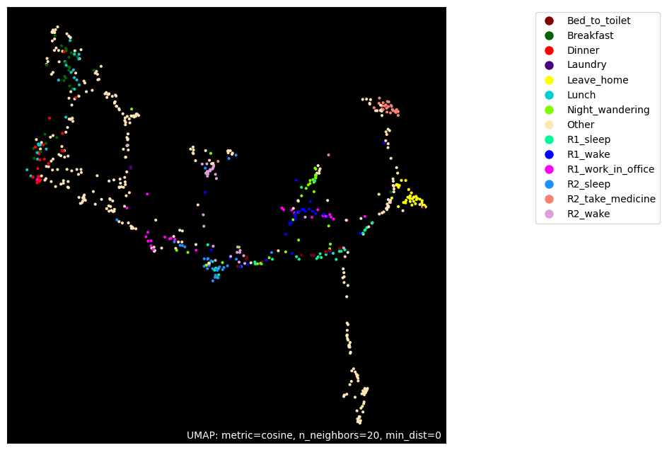

# Generative Pretrained Embedding and Hierarchical Representation to Unlock Human Rhythm in Activities of Daily Living

Welcome to the official GitHub repository for our article titled "Generative Pretrained Embedding and Hierarchical Representation to Unlock Human Rhythm in Activities of Daily Living". This repository contains the code, figures, and additional resources related to our research.


## Abstract
Our research presents a novel approach to understanding human rhythm in daily activities using the Generative Pretrained Embedding and Hierarchical Representation (GPTHAR) method. Through this, we seek to unlock new dimensions in activity recognition and bring forward a nuanced model that accommodates various real-world scenarios.

## Datasets
To assess the robustness and versatility of our approach, we utilized the following datasets from the [CASAS collection](https://casas.wsu.edu/datasets/):

- **Aruba Dataset**: A dataset used to validate our model's proficiency in scenarios with a single resident.
- **Milan Dataset**: Used to probe the robustness of our model in the face of potential disturbances caused by pets or sensor issues.
- **Cairo Dataset**: Assesses the adaptability of our model in environments with multiple residents and potential overlapping activities.

All these datasets are part of the CASAS collection, and they originate from the homes of volunteers, collected over several months, presenting unbalanced classes.

### Details of the Selected Datasets

| **Dataset**           | **Aruba** | **Milan** | **Cairo** |
|-----------------------|-----------|-----------|-----------|
| Residents             | 1         | 1 + pet   | 2 + pet   |
| Number of Sensors     | 39        | 33        | 27        |
| Number of Activities  | 12        | 16        | 13        |
| Number of Days        | 219       | 82        | 56        |


### Results from Final Test Set

|                               | **Aruba**        | **Aruba (std)** | **Milan**        | **Milan (std)** | **Cairo**        | **Cairo (std)** |
|-------------------------------|------------------|-----------------|------------------|-----------------|------------------|-----------------|
| **ELMoAR (Window 60)**        | 84.76%           | 0.32            | 68.51%           | 1.02            | 69.12%           | 1.76            |
| **GPTAR (8 Heads 3 Layers)**  | 85.18%           | **0.22**        | 68.55%           | **1.00**        | 71.33%           | 2.08            |
| **ELMoHAR**                   | 88.22%           | 3.79            | 73.91%           | 1.31            | 74.75%           | 1.98            |
| **GPTHAR**                    | 88.55%           | 3.83            | 76.87%           | 1.61            | 83.60%           | 1.90            |
| **ELMoHAR + Time encoding**   | 89.71%           | 0.69            | 77.84%           | 3.24            | 81.87%           | 2.26            |
| **GPTHAR + Time encoding**    | **90.10%**       | 1.05            | **79.22%**       | 1.27            | **86.74%**       | **1.16**        |


## Installation

To ensure a smooth experience while running the experiments, follow the steps below:

1. **Install the Required Libraries**:

```bash
pip install -r requirements.txt
```

2. **Set Up the Smart Home HAR Library**:

Navigate to the SmartHomeHARLib directory and install our custom library for Smart Home HAR:

```bash
cd SmartHomeHARLib
python setup.py develop --user
```

Once these steps are completed, you will be ready to proceed with the experiments.

## Running the Experiments

Here's a step-by-step guide on how to run the various experiments:

1. **Prepare the Datasets**

To properly set up the datasets for experiments, follow these steps:

- **Dataset Splitting**: 
  Run the `data_preprocessing_time.ipynb` script on each dataset. This will both prepare and divide each dataset into training and test sets.

- **Preparation for Classification Tasks**: 
  Utilize the `classification_data_preprocessing_time.ipynb` script for each dataset. This script prepares the datasets specifically for classification tasks. The aforementioned classification preparation script segments the dataset into distinct activities, ensuring data readiness for various experiments.

- **Preparation for tasks with separators**: 
    Run the `GPT_sep.ipynb` and `classification_data_preprocessing_time_with_sep.ipynb`scripts on each dataset. This will prepare the dataset for the experiments with the special separator token.


2. **Train the Pre-trained Embeddings**

To train the embeddings, first navigate to the `Code` directory:

```bash
cd Code
```
Then, run the commands for each of the embeddings:

- **ELMo Pre-trained Embedding**:
```bash
python ELMoEmbeddingExperimentations.py --d cairo --e elmo --c configs/embeddings/ELMo_60.json
```

- **GPT Pre-trained Embedding:**:
```bash
python GPTEmbeddingExperimentations.py --d cairo --e gpt2 --c configs/embeddings/GPT2_8H_3L_384E.json
```

**Parameters**:
- `--d`: Dataset selection (e.g., aruba, milan, cairo).
- `--e`: Experiment type (e.g., elmo for the standard ELMo embedding, gpt2 for the standard GPT embedding).
- `--c`: Path to the configuration files containing the experiment parameters.


3. **Run Cross-validation Experiments**

Navigate to the `Code` directory:

```bash
cd Code
```
Use the following command to initiate the training process:

```bash
python classification_train.py --d cairo --e GPTAR --c configs/GPTAR/cairo_bi_lstm_gpt2_8H_3L_384E.json --n 10 --cv True
```

**Parameters**:
- `--d`: Dataset selection (e.g., aruba, milan, cairo).
- `--e`: Specifies the experiment type. For instance, `GPTAR` represents using the GPT pretrained embedding combined with a bi-directional LSTM classifier architecture.
- `--c`: Path to the configuration files containing the experiment parameters.
- `--n`:  Determines the number of times the experiment should be repeated.
- `--cv`: Determines the experiment mode. When set to `True`, the experiment employs cross-validation. If not, the algorithm uses the full training set for training and the test set for validation. Defaults to `True`.

**Experiments List**:
- `ELMoAR`: ELMo pretrained embedding paired with a bi-directional LSTM classifier architecture.
- `GPTAR`:  GPT pretrained embedding paired with a bi-directional LSTM classifier architecture.
- `ELMoHAR`: Hierarchical ELMo pretrained embedding structure paired with a bi-directional LSTM classifier architecture.
- `GPTHAR`:  Hierarchical GPT pretrained embedding structure paired with a bi-directional LSTM classifier architecture.
- `ELMoAR_H`: Hierarchical ELMo pretrained embedding structure with Time encoding, paired with a bi-directional LSTM classifier architecture.
- `GPTAR_H`: Hierarchical GPT pretrained embedding structure with Time encoding, paired with a bi-directional LSTM classifier architecture.
- `ELMoAR_C`: retrained embedding paired with a bi-directional LSTM classifier architecture, employing an extended context window that includes the two preceding activity sequences.
- `GPTAR_C`: GPT pretrained embedding paired with a bi-directional LSTM classifier architecture, employing an extended context window that includes the two preceding activity sequences.
- `ELMoAR_C_S`:   ELMo pretrained embedding paired with a bi-directional LSTM classifier architecture, using an extended context window that captures the two preceding activity sequences. Activity sequences are distinguished by a unique separator token.
- `GPTAR_C_S`: GPT pretrained embedding paired with a bi-directional LSTM classifier architecture, using an extended context window that captures the two preceding activity sequences. Activity sequences are distinguished by a unique separator token.


4. **Execute Final Test Experiments**

Navigate to the `Code` directory:

```bash
cd Code
```
Use the following command to initiate the training process:

```bash
python classification_train.py --d cairo --e GPTAR --c configs/GPTAR/cairo_bi_lstm_gpt2_8H_3L_384E.json --n 10 --cv False
```


## Activities Embedding
In this section, we present the embeddings of activities from the three datasets: Aruba, Milan, and Cairo. Embeddings capture the relationships between different activities and provide a visual representation of the activity's feature space. We compare the embeddings generated by two prominent models: ELMo and GPT. Left images showcases the activities embedded using ELMo models, while right illustrates those embedded by GPT models.
### Abura Embedding
<div align="center">
    
    
</div>

### Milan Embedding
<div align="center">
    
    
</div>


### Cairo Embedding
<div align="center">
    
    
</div>
